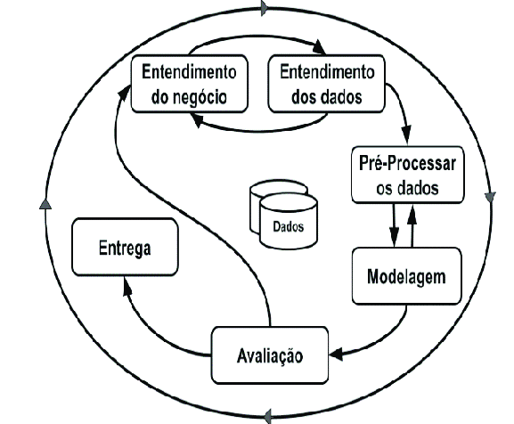

# Desafio-3-ZettaLab-2ed
Combate e Prevenção de Incêndios

## Índices

- [Estrutura do Projeto](#estrutura-do-projeto)
- [Metodologia CRISP-DM](#metodologia-crisp-dm)
- [Arquitetura do Projeto](#arquitetura-do-projeto)
- [Requisitos](#requisitos)
- [Instalação](#instalação)
- [Responsáveis](#responsáveis)

## Estrutura do Projeto

* [Scripts](./scripts/README.md): Módulos reutilizaveis.
* [Dados](./data/README.md): Descrições e Informações sobre os Dados.
* [Notebooks](./notebooks/README.md): dasdasjdsadalçskdlçsaka.
* [Reports](./reports/README.md):dasdasjdsadalçskdlçsaka.
* [Interactive Reports](./reports/README.md): dasdasjdsadalçskdlçsaka.
* [Models](./models/README.md): dzdadadasdasdsadsa.

## Metodologia CRISP-DM



- **Entendimento do negócio**: A primeira etapa é, possivelmente, a mais importante de todo o processo. Caso ela não seja feita da maneira correta, todo o resto do projeto pode ser invalidado futuramente. Nesta etapa, é definido o objetivo do projeto e as necessidades da empresa ou projeto em análise. Por isso, é necessário que todos estejam bem-informados e completamente alinhados.
- **Compreensão dos dados**: Depois da primeira etapa, podemos começar a pensar nos dados que serão utilizados no processo. Para isso podemos fazer várias perguntas, como: “A empresa tem banco de dados? Os dados serão acessados de que forma? Quantas fontes de dados serão utilizadas? Quais serão os formatos dos dados? Os dados estão estruturados?”. A partir delas, é feita a coleta dos dados, tomando cuidado para que nenhuma informação importante fique de fora. 
- **Preparação dos dados**: Com os dados já coletados, é preciso organizá-los de modo a conseguirmos enxergar o que eles contam. Esta etapa também pode ser guiada por algumas perguntas: “Como os valores nulos devem ser tratados? Os atributos estão nos formatos corretos? Será necessário fazer alguma fusão com outros dados? Quais variáveis serão utilizadas na modelagem?”. Esta costuma ser a parte mais demorada e trabalhosa de todas, porém um bom trabalho aqui significa menos retrabalho futuro.
- **Modelagem**: Nesta etapa o modelo começa a tomar forma e podemos ver os primeiros resultados. O tipo de modelagem a ser utilizada normalmente é definida de acordo com a necessidade do negócio e com o tipo de variável a ser analisada. Com a definição de qual modelo será utilizado, devem ser definidos quais atributos serão variáveis na construção deste modelo. “Aqui pode ser muito útil voltar à primeira etapa para conferir objetivos e encontrar novas possibilidades”, aconselha Prado.
- **Implementação**: Com o modelo já em mãos, podemos avaliar se o se o resultado corresponde à expectativa do projeto. Caso a resposta seja negativa ou a equipe considere que há espaço para melhorias, todas as forças devem ser direcionadas para fazer as mudanças necessárias. Estas mudanças podem ter diversas formas, como a retirada de atributos estatisticamente insignificantes, correção na entrada de dados, correção no tratamento dos atributos etc.
- **Entrega (Deployment)**: Caso o processo tenha sido feito da maneira correta, esta será a última etapa. Aqui, o modelo deve ser colocado em produção, de modo a agregar valor para o negócio. A forma como isso é feito varia muito, dependendo do tipo de modelo e projeto. Esse modelo deve ficar exposto para acesso, normalmente armazenado na nuvem ou em servidores locais da própria empresa.

## Arquitetura do Projeto


## Pré-requisitos

- [Python 3.13.1](https://www.python.org/downloads/latest/python3.13/)
- [UV](https://github.com/astral-sh/uv)
- [Docker](https://www.docker.com/)

## Instalação

```bash
git clone git@github.com:EstevaoAugusto/fire-control-data-science.git
cd fire-control-data-science/
```

```bash
uv sync

# Opcional
source .venv/Scripts/activate
```

```bash
python config_path.py
```

## Responsáveis

- Luciana Laibe Santos Silva, Comunicação e Marketing (9° Período, Graduação em Ciências Biológicas)
- Estevão Augusto da Fonseca Santos, Ciência e Governança de Dados (6° Período, Graduação em Ciência de Computação)
- Hugo Dias Pontello, Desenvolvimento de Software (5° Período, Graduação em Sistemas de Informação)
- Lorrana Verdi Flores, Desenvolvimento de Software (6° Período, Doutorado em Biotecnologia Vegetal)
- Bruna Oliveira Pereira, Geotecnologia (4° Período, Graduação em Engenharia Florestal)
- Geovanna Alexandre Possidonio, Gestão de Projetos (4° Período, Graduação em Administração)
